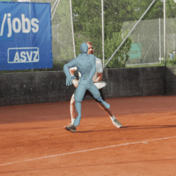
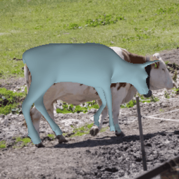
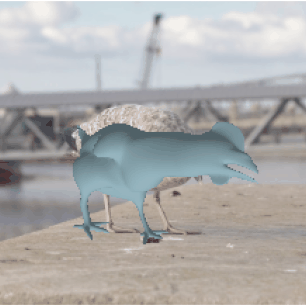
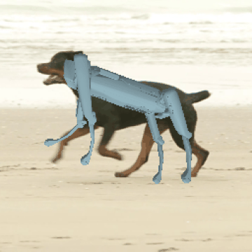

# MorphGS: Morphology-Adaptive Articulated 3D Motion Transfer from Videos

[](https://xodus777.github.io/MorphGS/)
[](https://arxiv.org/abs/2601.02716)

Official implementation of **MorphGS: Morphology-Adaptive Articulated 3D Motion
Transfer from Videos**.

Taeyeon Kim<sup>&ast;</sup>, Youngju Na<sup>&ast;</sup>, Jumin Lee, Sebin Lee, Minhyuk Sung, and Sung-Eui Yoon<sup>&dagger;</sup>  

<sup>&ast;</sup>Equal contribution. <sup>&dagger;</sup>Corresponding author.

<p>
  
  
  
  
</p>

> Transferring articulated motion from monocular videos to rigged 3D characters is challenging due to pose ambiguity in 2D observations and morphological differences between source and target. Existing approaches often follow a reconstruct-then-retarget paradigm, tying transfer quality to intermediate 3D reconstruction and limiting applicability to categories with parametric templates. We propose MorphGS, a framework that formulates motion retargeting as a target-driven analysis-by-synthesis problem, directly optimizing target morphology and pose through image-space supervision. A rig-coupled morphology parameterization factorizes character identity from time-varying joint rotations, while dense 2D-3D correspondences and synthesized views provide complementary structural and multi-view guidance. Experiments on synthetic benchmarks and real-world videos show consistent improvements over baselines.

## Installation

This copy is the one bundled inside
[ComfyUI-MorphGS](https://github.com/Yuvaraj0739X/ComfyUI-MorphGS); its dependencies are
installed by that package's `requirements.txt` + `install.py` (prebuilt `pytorch3d` and
`gsplat` wheels matched to the running torch/CUDA build -- no CUDA toolkit needed). To use it
standalone:

```bash
# any CUDA build of torch 2.4+ (pick the +cuXXXtorchX.Y tag matching yours)
pip install -r requirements.txt
pip install pytorch3d==0.7.9+cu130torch2.10 gsplat==1.5.3+cu130torch2.10     --extra-index-url https://pozzettiandrea.github.io/cuda-wheels/v2/
```

Rendering uses gsplat (Apache-2.0) through `src/feature_splatting/gsplat_rasterizer.py`; the
original non-commercial `diff-gaussian-rasterization` / `simple-knn` extensions are not used
or shipped.

Optional preprocessing components:

- **Geo-Aware semantic features**: clone
  [GeoAware-SC](https://github.com/Junyi42/GeoAware-SC) into
  `src/extlibs/GeoAware` and install it with
  `pip install -e . --no-build-isolation`.
- **SV4D 2.0 synthesized views**: clone
  [generative-models](https://github.com/Stability-AI/generative-models)
  branch `sp4d` into `src/extlibs/generative-models` and download its
  checkpoints.

## Try Demo

Download the demo data from
[Google Drive](https://drive.google.com/file/d/1oMkA02aJYhoBSNPZX9tMPknvVvX50i-z/view?usp=sharing)
and place it at `demo/`.
The demo includes four scenes across different categories:

- Humanoid: `tennis_to_Ninja`
- Quadruped: `cow_to_moose1DOG`
- Bird: `seagull_to_chickenDC`
- Robot: `dog_to_spot`

<details>
<summary>Demo Data Sources</summary>

Video sources:

- `tennis`: [DAVIS](https://davischallenge.org/).
- `cow` and `dog`: [BADJA](https://github.com/benjiebob/BADJA).
- `seagull`: Video by Paul Daley from
  [Pexels](https://www.pexels.com/video/close-up-video-of-white-seagull-1536290/).

Target character sources:

- `Ninja`: [Mixamo](https://www.mixamo.com/).
- `moose1DOG` and `chickenDC`:
  [DeformingThings4D](https://github.com/rabbityl/DeformingThings4D).
- `spot`: Spot URDF assets from
  [Daniella1/urdf_files_dataset](https://github.com/Daniella1/urdf_files_dataset).

</details>

Train directly from the demo configs:

```bash
python src/main.py --config demo/tennis_to_Ninja.yaml
python src/main.py --config demo/cow_to_moose1DOG.yaml
python src/main.py --config demo/seagull_to_chickenDC.yaml
python src/main.py --config demo/dog_to_spot.yaml
```

Outputs are written to `output/<experiment>/`. `demo/<experiment>.yaml` is a
shorthand for `configs/demo/<experiment>.yaml`; the experiment name is inferred
from the config filename.

## Running On A New Video

Set the dataset root if you are not using the bundled `demo/` directory:

```bash
export MORPHGS_DATA_ROOT=/path/to/data
```

### 1. Source Clip

Prepare an object-centric video clip at:

```text
$MORPHGS_DATA_ROOT/videos/<scene>/rgb.mp4
```

The subject should be segmented, centered in a square frame, and composited on a
white background. We recommend [SAM 3](https://github.com/facebookresearch/sam3) for
background masking. The `rgb.mp4` frames themselves must also be
background-masked object-centric square frames.

### 2. Target Character

Prepare a rigged target character at:

```text
$MORPHGS_DATA_ROOT/characters/<target>/
```

Required files:

```text
characters/<target>/
├── mesh.obj
├── texture.png               # optional
└── rigging/mesh_ori_rig.txt  # RigNet-format skeleton + skinning weights
```

The release training and rendering scripts use the
[RigNet](https://github.com/zhan-xu/rignet)-format rig at
`rigging/mesh_ori_rig.txt`.

### 3. Preprocess

```bash
python src/preprocess/preprocess_src.py $MORPHGS_DATA_ROOT/videos/<scene>/rgb.mp4 \
    --mode sv4d
python src/preprocess/preprocess_tgt.py $MORPHGS_DATA_ROOT/characters/<target>
```

`preprocess_src.py` writes `processed_videos/<scene>/`. `preprocess_tgt.py`
writes target canonical-view renders, cameras, visibility masks, and semantic
features. The released demo data includes the lightweight processed frames and
target assets, plus `cache/<experiment>/feats_3d.pt` and
`cache/<experiment>/mapping/` so demo runs do not need to ship per-view 2D
feature tensors.

Use `--sv4d_stride` / `--sv4d_max_frames` to
subsample longer clips.

### 4. Register And Train

Create `configs/demo/<scene>_to_<target>.yaml`, or pass project paths with CLI
overrides. Demo config filenames are parsed as `<source>_to_<target>`, so no
experiment registration step is required.

```bash
python src/main.py --config configs/base.yaml --experiment <scene>_to_<target>
```

On the first run this builds caches under `output/<experiment>/`, including
dense 2D-3D correspondence maps, aggregated 3D features, and the GT thinning
cache.

## Training

```bash
python src/main.py \
    --config configs/base.yaml \
    --experiment tennis_to_Ninja \
    [optional] --model.opt.iterations=5000
```

- `--config`: training config. `configs/base.yaml` is the release default.
- `--experiment`: `<source>_to_<target>` pair. This directly resolves
  `$MORPHGS_DATA_ROOT/processed_videos/<source>` and
  `$MORPHGS_DATA_ROOT/characters/<target>`.
- Any config key can be overridden from the CLI as `--key.subkey=value`.
- Runs are seeded from `project.seed` in the config. Override it with
  `--project.seed=<seed>` when needed.

A 5k-iteration run on a ~10K-vertex target takes roughly 5 minutes on a
single RTX 4090.

## Rendering

```bash
python src/render.py \
    --config demo/tennis_to_Ninja.yaml \
    [optional] --iteration 5000
```

## Citation

```bibtex
@inproceedings{kim2026morphgs,
  title     = {MorphGS: Morphology-Adaptive Articulated 3D Motion Transfer from Videos},
  author    = {Kim, Taeyeon and Na, Youngju and Lee, Jumin and Lee, Sebin and Sung, Minhyuk and Yoon, Sung-Eui},
  booktitle = {European Conference on Computer Vision (ECCV)},
  year      = {2026},
}
```

## License

The original MorphGS code is released under the MIT License in
[LICENSE.md](LICENSE.md). This repository also includes third-party code and
code adapted from third-party projects. Those components retain their own
licenses and notices; see [THIRD_PARTY_NOTICES.md](THIRD_PARTY_NOTICES.md) for
attribution.
